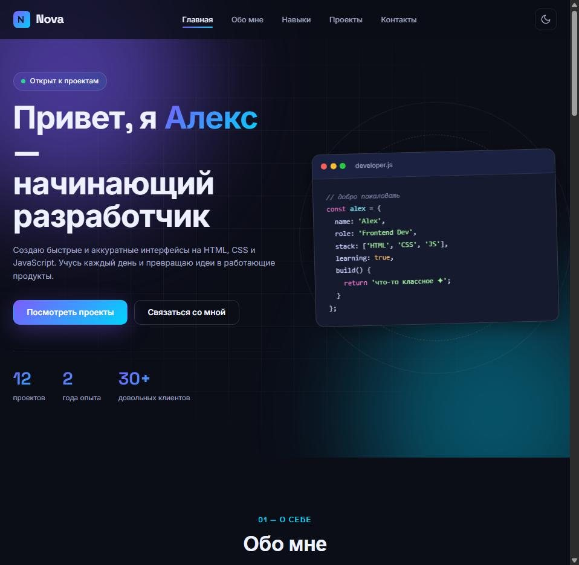
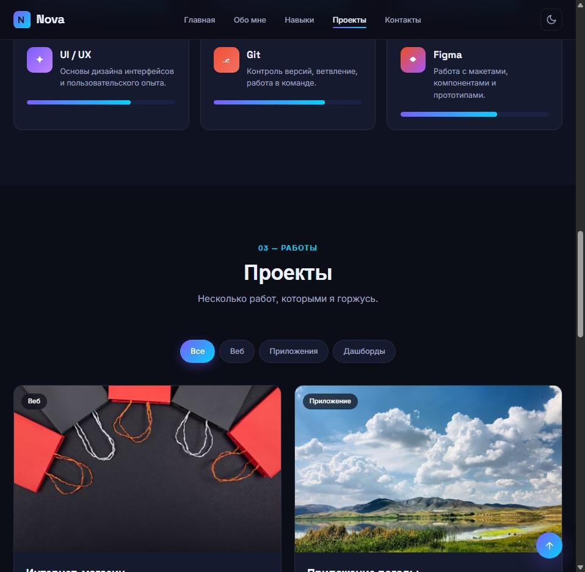
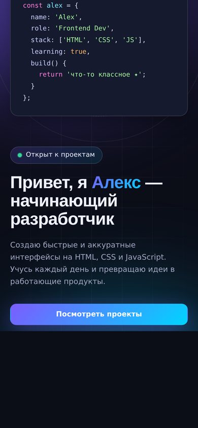

<div align="center">

# ✦ Nova — портфолио разработчика

**Одностраничный сайт-портфолио начинающего фронтенд-разработчика**, сделанный по техническому заданию: о себе, навыки, проекты с фильтрами и контакты.

[](https://fegke12.github.io/portfolio-developer/)


<br>



</div>

---

## Задача

По ТЗ нужен готовый к использованию одностраничник: представить владельца, показать навыки и работы, дать контакты и нормально выглядеть на любом экране. Исходное задание — в `uploads/`. Владелец сайта, «Алекс», — персонаж из ТЗ.

## Что сделано

- **Первый экран** с «карточкой кода» и счётчиками, которые анимируются при появлении.
- **Обо мне** — опыт, направление, интересы, цель.
- **Навыки** — HTML, CSS, JavaScript, UI/UX, Git, Figma с индикаторами уровня.
- **Проекты** с фильтрами «Веб / Приложения / Дашборды».
- **Контакты** и соцсети в подвале.
- **Тёмная и светлая тема** — выбор сохраняется в `localStorage`.
- Плавная прокрутка, подсветка активного раздела в меню, мобильное меню.

## Скриншоты

<table>
  <tr>
    <td width="70%"></td>
    <td align="center"></td>
  </tr>
  <tr>
    <td align="center"><sub>Навыки и проекты с фильтрами</sub></td>
    <td align="center"><sub>Мобильная версия</sub></td>
  </tr>
</table>

## Структура

```
index.html      вся страница
css/style.css   стили и темы
js/script.js    тема, меню, фильтры проектов, анимации
```

Сборка не нужна — откройте `index.html` в браузере. Хостинг — GitHub Pages.

---

<div align="center"><sub>Сделано <a href="https://github.com/Fegke12">@Fegke12</a> по техническому заданию</sub></div>
